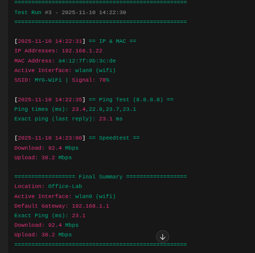
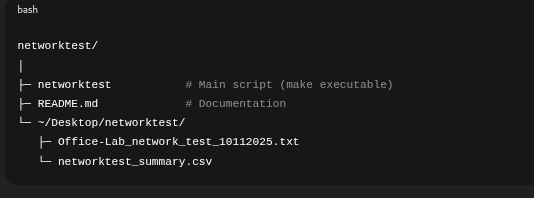

# 🛰️ NetworkTest – Bash-based Network Diagnostics Tool

**NetworkTest** is a simple yet powerful Bash script for Linux that performs detailed network diagnostics and saves the results locally.
It’s ideal for network engineers, field technicians, and sysadmins who want quick, repeatable testing with automatic log files and CSV summaries.

## 🚀 Features

- Interactive Mode — Run all tests or select specific ones
- Daily Log Files — Stored in `~/Desktop/networktest/<LOCATION>_network_test_DDMMYYYY.txt`
- CSV Summary Report — `~/Desktop/networktest/networktest_summary.csv`
- Auto-detects active interface, SSID & Wi-Fi signal strength
- Tests: IP/MAC, Gateway, Ping (exact ms), Speedtest (auto retry)
- Colored terminal output and persistent logs

## 🧰 Requirements

| Dependency | Purpose | Install (Debian/Ubuntu) |
|-------------|----------|-------------------------|
| `bash` | Shell interpreter | *(default)* |
| `nmcli` | NetworkManager CLI | `sudo apt install network-manager` |
| `ping` | Network reachability test | *(default)* |
| `speedtest` | Speedtest CLI by Ookla | `sudo apt install speedtest-cli` *(or Ookla’s official binary)* |
| `awk`, `grep`, `sed` | Text parsing tools | *(default)* |


## ⚙️ Installation

```bash
git clone https://github.com/<your-username>/networktest.git
cd networktest
chmod +x networktest
./networktest
```

## 📸 Screenshots

| Description | Screenshot |
|--------------|-------------|
| **Running networktest in terminal** |  |
| **structure of file system** |  |


## 🏷️ Author

**Sreerag M S**
Network Admin | Field Technician | Linux Enthusiast
